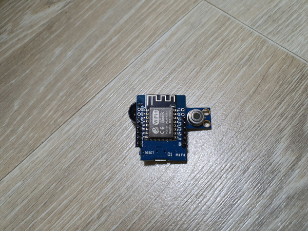

# arduino_temperature_alert
A buzz alarm sounds when the temperature is exceeded.

I use it for temperature monitoring when charging lipo batteries.

## Device

## youtube

## Circuit

## Alert Temperature Setting

## Additional Boadrds Manager URLs

http://arduino.esp8266.com/stable/package_esp8266com_index.json
